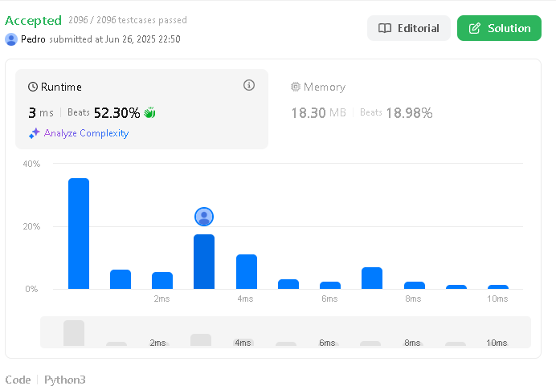
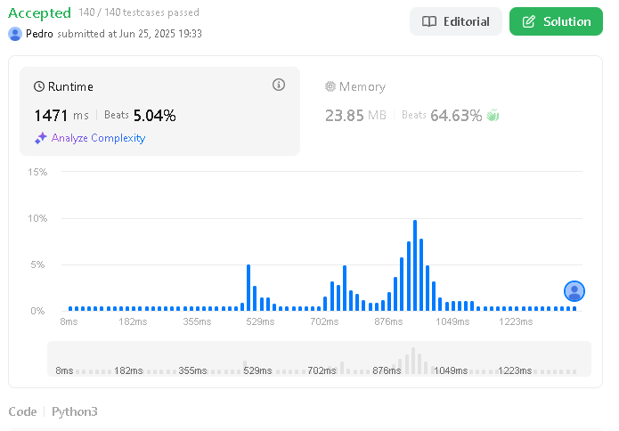
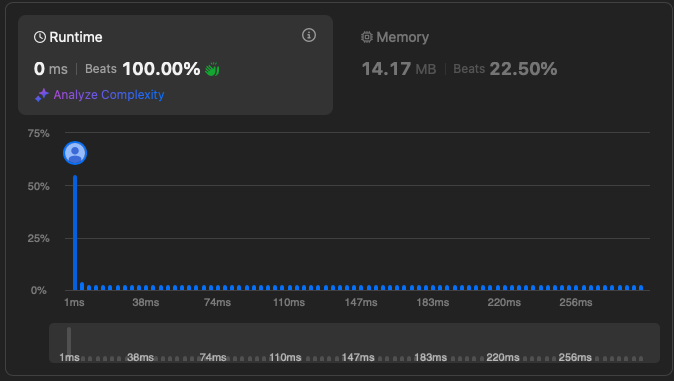
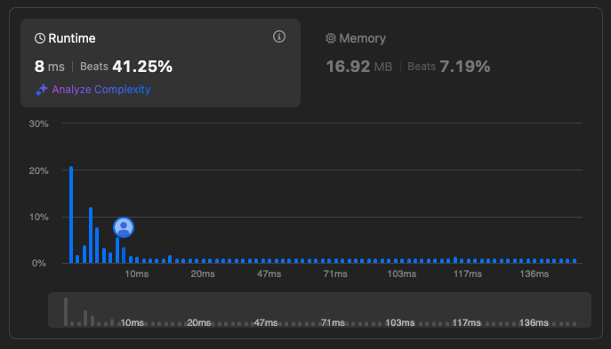

# Dividir_e_Conquistar-LeetCodeQuest

**Conteúdo da Disciplina**: Dividir e Conquistar  

## Alunos

| Matrícula  | Aluno                       |
| ---------- | --------------------------- |
| 20/0026151 | Pedro Henrique F. Nunes     |
| 18/0042041 | Gustavo Barbosa de Oliveira |

## Sobre

<!-- Descreva os objetivos do seu projeto e como ele funciona. -->

### Escolha da plataforma

Para este trabalho de Dividir e Conquistar, opitamos por utilizar um juiz eletrônico para resolver exercícios relacionados aos conceitos estudados em aula. Desta forma, escolhemos o LeetCode, pois oferece um vasto repositório de problemas de programação com níveis variados de dificuldade, cobrindo vários tópicos fundamentais em estruturas de dados e algoritmos, incluindo tarefas de dividir e conquistar. A plataforma possui um sistema automático de avaliação que testa as submissões contra múltiplos casos de teste.

### Exercícios escolhidos

Conforme mencionado acima, esse projeto visa contemplar a resolução de alguns exercícios sobre os conteúdos acerca de Dividir e Conquistar. Foram definidas 4 questões a serem resolvidas, sendo duas deles de nível médio e duas de nível difícil. Abaixo podemos identificar as questões que foram resolvidas dentro do juiz eletrônico LeetCode:

| Questão | Nome                                                                                                  | Dificuldade |
| ------- | ----------------------------------------------------------------------------------------------------- | ----------- |
| 04      | [Median of Two Sorted Arrays](https://leetcode.com/problems/median-of-two-sorted-arrays/description/) | Difícil     |
| 493     | [Reverse Pairs](https://leetcode.com/problems/reverse-pairs/description/)                             | Difícil     |
| 23      | [Merge k Sorted Lists](https://leetcode.com/problems/merge-k-sorted-lists/)                           | Difícil     |
| 347     | [Top K Frequent Elements](https://leetcode.com/problems/top-k-frequent-elements/description/)         | Média       |

### Link para o vídeo de apresentação

https://unbbr.sharepoint.com/:v:/s/PA790/EfFbz2kodMhOm0Y0DeKzccQBgwHqgJAyU1rb9hPkj4WxHw?e=Q5EKEN&nav=eyJyZWZlcnJhbEluZm8iOnsicmVmZXJyYWxBcHAiOiJTdHJlYW1XZWJBcHAiLCJyZWZlcnJhbFZpZXciOiJTaGFyZURpYWxvZy1MaW5rIiwicmVmZXJyYWxBcHBQbGF0Zm9ybSI6IldlYiIsInJlZmVycmFsTW9kZSI6InZpZXcifX0%3D

## Screenshots

Segue abaixo Screenshots demonstrando que as soluções para os respectivos problemas foram aceitas em todos os testes de caso:

_Questão 04 - Median of Two Sorted Arrays_

_Questão 493 - Reverse Pairs_

_Questão 23 - Merge k Sorted Lists_

_Questão 347 - Top K Frequent Elements_

## Instalação

**Linguagem**: Python, C  

<!-- Descreva os pré-requisitos para rodar o seu projeto e os comandos necessários -->

### Uso

<!-- Explique como usar seu projeto caso haja algum passo a passo após o comando de execução. -->

A seguir, é explicado como qualquer pessoa pode copiar e testar os códigos presente neste repositório diretamente no LeetCode:

- _Acesse o site do LeetCode_:
  Para acessar a questão no LeetCode, vá para o site por qualquer um dos links na tabela Sobre. Para executar os testes de caso e identificar se a solução foi aceita, será necessário se cadastrar ou fazer login.

- _Copie o código do repositório_:
  Acesse a pasta DividireConquistar deste repositório, clique no número do exercício e copie o código referente à questão desejada.

- _Cole o código no editor do LeetCode_:
  No ambiente da questão, selecione a linguagem correta do código que foi utilizado para resolver a questão(por exemplo, Python ou C) e cole o código no editor online.

- _Execute e submeta_:
  Clique em “Run” para testar com os casos de exemplo ou em “Submit” para rodar todos os casos de teste oficiais do LeetCode.
